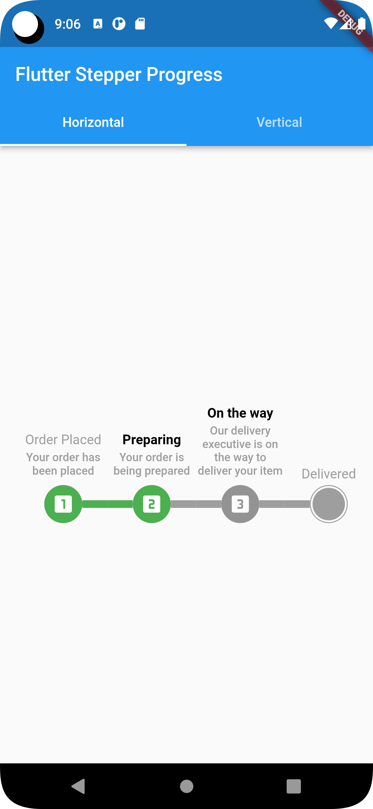
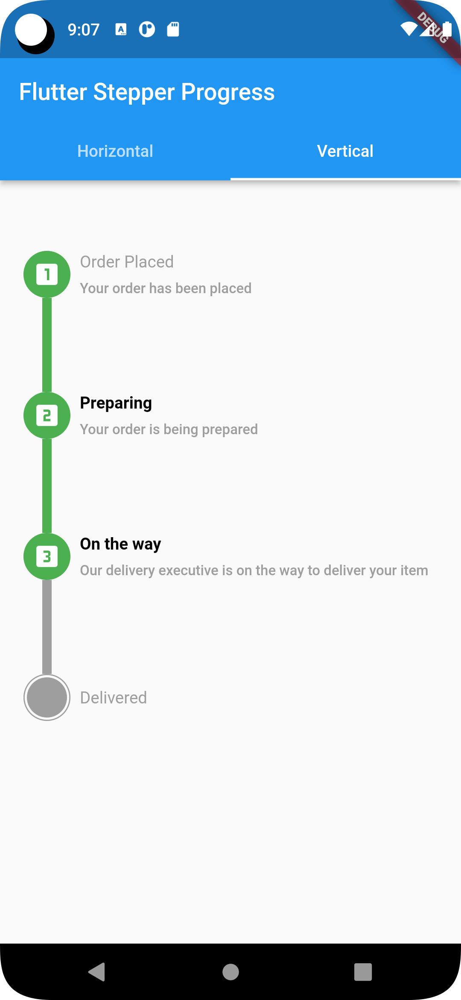

# step_progress_bar
Examples of Flutter Step progress bar. if you want flork or clone and use it.

[comment]: <> (![Flutter Horizontal Stepper Progress]&#40;Horizontal.png&#41;)

[comment]: <> (![Flutter Vertical Stepper Progress]&#40;Vertical.png&#41;)
